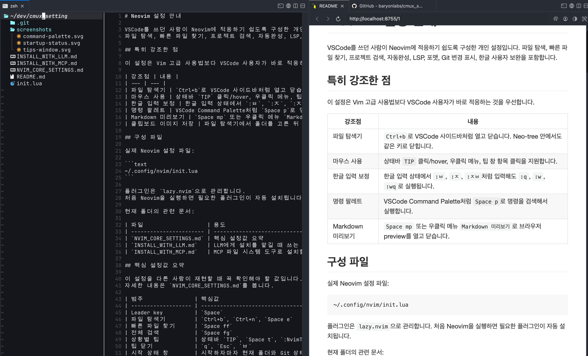
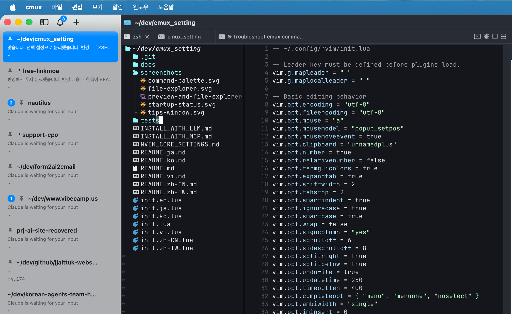
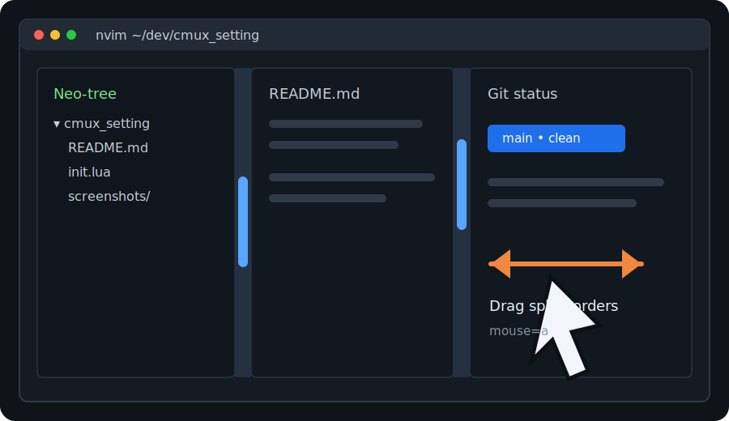

<h1 align="center">cmux를 위한 Neovim 파일 편집 세팅</h1>
<p align="center">VSCode 사용자와 한글 사용자를 위한 cmux 친화 Neovim 설정</p>

<p align="center">
  한국어 | <a href="README.md">English</a> | <a href="README.ja.md">日本語</a> | <a href="README.zh-CN.md">简体中文</a> | <a href="README.zh-TW.md">繁體中文</a> | <a href="README.vi.md">Tiếng Việt</a>
</p>

<p align="center">
  <a href="https://github.com/baryonlabs/cmux_setting_vscode_style_nvim"></a>
  
  
  <a href="LICENSE"></a>
</p>

<p align="center">
  
</p>

<a href="https://cmux.com/">cmux</a>는 여러 AI 코딩 에이전트를 실행하고 조율하는 멀티 에이전트 코딩 워크스페이스입니다.

cmux를 사용할 때 파일 편집과 관리를 한 번에 처리하기 위한 Neovim 도구 세팅입니다.
VSCode를 쓰던 사람이 Neovim에 적응하기 쉽도록 구성했습니다.
파일 탐색, 빠른 파일 찾기, 프로젝트 검색, 자동완성, LSP, 포맷, Git 변경 표시, 마우스 창 크기 조절, 한글 사용자 보완을 포함합니다.

## 기능 한눈에 보기

<table>
<tr>
<td width="40%" valign="middle">
<h3>VSCode식 파일 탐색</h3>
<code>Ctrl+b</code>로 Neo-tree 파일 탐색기를 열고 닫습니다. 탐색기 안에서도 같은 키로 닫힙니다.
</td>
<td width="60%">

</td>
</tr>
<tr>
<td width="40%" valign="middle">
<h3>Markdown 미리보기</h3>
<code>Space mp</code> 또는 우클릭 메뉴로 브라우저 preview를 열고, 포트는 <code>8755</code>로 고정합니다.
</td>
<td width="60%">

</td>
</tr>
<tr>
<td width="40%" valign="middle">
<h3>마우스로 창 크기 조절</h3>
터미널 Neovim 안에서 마우스로 창을 선택하고 분할 창 크기를 조절할 수 있습니다.
</td>
<td width="60%">

</td>
</tr>
</table>

기여를 환영합니다. 이 프로젝트는 [MIT License](LICENSE)로 공개합니다.

## 특히 강조한 점

이 설정은 Vim 고급 사용법보다 VSCode 사용자가 바로 적응하는 것을 우선합니다.

| 강조점 | 내용 |
| --- | --- |
| 파일 탐색기 | `Ctrl+b`로 VSCode 사이드바처럼 열고 닫습니다. Neo-tree 안에서도 같은 키로 닫힙니다. |
| 마우스 사용 | 창 선택과 분할 창 크기 조절을 마우스로 할 수 있고, 우클릭 메뉴도 지원합니다. |
| 한글 입력 보정 | 한글 입력 상태에서 `:ㅂ`, `:ㅈ`, `:ㅈㅂ`처럼 입력해도 `:q`, `:w`, `:wq`로 실행됩니다. |
| Markdown 미리보기 | `Space mp` 또는 우클릭 메뉴 `Markdown 미리보기`로 브라우저 preview를 열고 닫습니다. |

## 다국어 README

현재 지원:

| 언어 | 문서 |
| --- | --- |
| 한국어 | `README.ko.md` |
| English | `README.md` |
| 日本語 | `README.ja.md` |
| 简体中文 | `README.zh-CN.md` |
| 繁體中文 | `README.zh-TW.md` |
| Tiếng Việt | `README.vi.md` |

번역 기준은 cmux README처럼 상단 언어 링크를 유지하고, 스크린샷/설치 명령/핵심 단축키는 모든 언어에서 같은 구조로 맞추는 것입니다.

언어별 Neovim 진입 파일도 제공합니다.

| 언어 | 파일 |
| --- | --- |
| 한국어 | `init.ko.lua` |
| English | `init.en.lua` |
| 日本語 | `init.ja.lua` |
| 简体中文 | `init.zh-CN.lua` |
| 繁體中文 | `init.zh-TW.lua` |
| Tiếng Việt | `init.vi.lua` |

실제 설정은 `init.lua` 하나를 기준으로 유지합니다. 언어별 파일을 설치할 때는 기본 설정을 `cmux-base.lua`로 복사하고, 선택한 언어의 `init.*.lua`를 최종 `init.lua`로 복사합니다.

한국어 진입 파일로 수동 설치:

```sh
git clone https://github.com/baryonlabs/cmux_setting_vscode_style_nvim.git
cd cmux_setting_vscode_style_nvim
mkdir -p ~/.config/nvim
cp init.lua ~/.config/nvim/cmux-base.lua
cp init.ko.lua ~/.config/nvim/init.lua
nvim
```

언어 wrapper 없이 기본 설정만 바로 쓰려면 다음처럼 설치해도 됩니다.

```sh
mkdir -p ~/.config/nvim
cp init.lua ~/.config/nvim/init.lua
nvim
```

## 구성 파일

실제 Neovim 설정 파일:

```text
~/.config/nvim/init.lua
```

플러그인은 `lazy.nvim`으로 관리합니다.
처음 Neovim을 실행하면 필요한 플러그인이 자동 설치됩니다.

현재 폴더의 관련 문서:

| 파일                    | 용도                                             |
| ----------------------- | ------------------------------------------------ |
| `NVIM_CORE_SETTINGS.md` | 핵심 설정값 요약                                 |
| `INSTALL_WITH_LLM.md`   | LLM에게 설치를 맡길 때 쓰는 프롬프트와 검증 절차 |
| `INSTALL_WITH_MCP.md`   | MCP 파일 시스템 도구로 설치할 때 쓰는 작업 절차  |
| `docs/AGENTIXWORK_INTEGRATION.md` | AgentixWork Terminal의 `Nvim` 버튼 연동 계약 |
| `docs/ZSH_SETTINGS.md`  | zsh 히스토리 검색, `Ctrl+s`, Claude/Codex 터미널 사용 보조 |

## 핵심 설정값 요약

이 설정을 다른 사람이 재현할 때 꼭 확인해야 할 값입니다.
자세한 내용은 `NVIM_CORE_SETTINGS.md`를 봅니다.

| 범주                | 핵심값                                         |
| ------------------- | ---------------------------------------------- |
| Leader key          | `Space`                                        |
| 파일 탐색기         | `Ctrl+b`, `Ctrl+n`, `Space e`                  |
| 빠른 파일 찾기      | `Space ff`                                     |
| 전체 검색           | `Space fg`                                     |
| 상황별 팁           | 상태바 `TIP`, `Space t`, `:NvimTipsKo`         |
| 팁 닫기             | `q`, `Esc`, `ㅂ`                               |
| 시작 상태 창        | 시작하자마자 현재 폴더와 Git 상태 표시         |
| Markdown preview    | 포트 `8755`, 자동 시작 꺼짐                    |
| 한글 입력 보정      | `:ㅂ` -> `:q`, `:ㅈ` -> `:w`, `:ㅈㅂ` -> `:wq` |
| Markdown Treesitter | Markdown만 Treesitter 시작 차단                |

LLM이나 MCP 에이전트로 설치할 때는 다음 문서를 사용합니다.

```text
INSTALL_WITH_LLM.md
INSTALL_WITH_MCP.md
```

LLM이나 MCP 에이전트에게는 저장소 URL만 주고 설치 또는 설명을 요청해도 됩니다.

```text
https://github.com/baryonlabs/cmux_setting_vscode_style_nvim/
```

## 주요 기능

| 기능                | 플러그인/설정                                          |
| ------------------- | ------------------------------------------------------ |
| 플러그인 관리       | `lazy.nvim`                                            |
| 단축키 안내         | `which-key.nvim`                                       |
| 파일 탐색기         | `neo-tree.nvim`                                        |
| 파일 찾기/전체 검색 | `telescope.nvim`                                       |
| 문법 하이라이트     | `nvim-treesitter`                                      |
| Markdown 미리보기   | `markdown-preview.nvim`                                |
| LSP                 | `nvim-lspconfig`, `mason.nvim`, `mason-lspconfig.nvim` |
| 자동완성            | `nvim-cmp`                                             |
| 포맷                | `conform.nvim`                                         |
| Git 변경 표시       | `gitsigns.nvim`                                        |
| 상태바              | `lualine.nvim`                                         |
| 한글 입력기 보조    | `im-select.nvim`                                       |

## VSCode와 비교

| VSCode                  | Neovim에서의 사용                 |
| ----------------------- | --------------------------------- |
| Explorer 사이드바       | `Ctrl+b`, `Ctrl+n` 또는 `Space e` |
| Command Palette         | `Space p` 또는 `Ctrl+Shift+P`     |
| Quick Open              | `Space ff`                        |
| 전체 프로젝트 검색      | `Space fg`                        |
| 열린 파일 목록          | `Space fb`                        |
| 저장                    | `Ctrl+s`, `Space w` 또는 `:w`     |
| 창 닫기                 | `Ctrl+w`, `Space q` 또는 `:q`     |
| Go to Definition        | `gd`                              |
| Hover 문서              | `K`                               |
| Rename Symbol           | `Space lr`                        |
| Quick Fix / Code Action | `Space la`                        |
| Format Document         | `Space lf` 또는 저장 시 자동 포맷 |

## 초보자 필수 개념

Neovim은 VSCode와 다르게 모드가 있습니다.

| 모드         | 의미                            |
| ------------ | ------------------------------- |
| Normal mode  | 이동, 삭제, 복사, 명령 실행     |
| Insert mode  | 실제 글자 입력                  |
| Visual mode  | 범위 선택                       |
| Command mode | 저장, 종료, 검색 같은 명령 실행 |

가장 중요한 흐름:

```text
i      입력 시작
Esc    입력 종료 / Normal mode로 돌아가기
```

처음에는 `i`와 `Esc`만 확실히 익히면 됩니다.

## 주요 단축키

| 단축키             | 설명                                      |
| ------------------ | ----------------------------------------- |
| `Space`            | 단축키 안내 열기                          |
| `Space ?`          | 한글 초보자 도움말                        |
| `Space t`          | 상황별 사용 팁 열기                       |
| 상태바 `TIP`       | 마우스를 올리거나 클릭해서 상황별 팁 열기 |
| 마우스 우클릭 메뉴 | `상황별 팁` 항목으로 팁 열기              |
| 마우스 우클릭 메뉴 | `Markdown 미리보기` 항목으로 preview 토글 |
| `Ctrl+b`           | VSCode처럼 파일 탐색기 열기/닫기          |
| `Ctrl+n`           | 파일 탐색기 열기/닫기                     |
| `Space e`          | 파일 탐색기 열기/닫기                     |
| `Space E`          | 현재 파일 위치를 탐색기에서 보기          |
| `Space ff`         | 파일 찾기                                 |
| `Space fg`         | 프로젝트 전체 검색                        |
| `Space fb`         | 열린 파일 목록                            |
| `Space fh`         | 도움말 검색                               |
| `Space p`          | 명령 팔레트 열기                          |
| `Ctrl+Shift+P`     | 명령 팔레트 열기                          |
| `Space mp`         | Markdown 미리보기 열기/닫기               |
| `Space mo`         | Markdown 미리보기 열기                    |
| `Space mc`         | Markdown 미리보기 닫기                    |
| `Ctrl+s`           | 저장                                      |
| `Space w`          | 저장                                      |
| `Space q`          | 현재 창 닫기                              |
| `Ctrl+w`           | 현재 창 닫기                              |
| `Ctrl+h`           | 왼쪽 창으로 이동                          |
| `Ctrl+j`           | 아래 창으로 이동                          |
| `Ctrl+k`           | 위 창으로 이동                            |
| `Ctrl+l`           | 오른쪽 창으로 이동                        |
| `Esc`              | 검색 강조 지우기                          |

`Ctrl+b`는 일반 편집 화면뿐 아니라 파일 탐색기 안에서도 같은 동작을 합니다.
Neo-tree의 기본 `Ctrl+b`는 preview 스크롤이지만, VSCode 사용자에게 익숙한 사이드바 토글 동작으로 덮어썼습니다.

## 시작 상태 창

Neovim을 실행하면 바로 현재 상태를 보여주는 작은 창이 뜹니다.

표시 내용:

| 항목 | 설명 |
| --- | --- |
| 현재 폴더 | 지금 Neovim이 열린 작업 디렉터리 |
| Git branch | 현재 Git 브랜치 |
| Git status | 변경된 파일 개수와 일부 목록 |

Git 저장소가 아닌 폴더에서는 `Git: 저장소 아님`으로 표시됩니다.
VSCode처럼 파일 저장, Neovim 포커스 복귀, 외부 파일 변경 이벤트가 있으면 시작 상태 창의 Git 상태를 다시 계산합니다.

닫기:

```text
q
Esc
ㅂ
```

수동 새로고침:

```text
r
```

다시 보고 싶으면 다음 명령을 실행합니다.

```vim
:NvimStartupStatus
```

## LSP 단축키

코드 파일에서 사용할 수 있습니다.

| 단축키     | 설명              |
| ---------- | ----------------- |
| `gd`       | 정의로 이동       |
| `gr`       | 참조 찾기         |
| `K`        | 문서 보기         |
| `Space lr` | 이름 바꾸기       |
| `Space la` | 빠른 수정         |
| `Space ld` | 현재 줄 오류 보기 |
| `[d`       | 이전 오류         |
| `]d`       | 다음 오류         |
| `Space lf` | 파일 포맷         |

## 자동 설치되는 언어 도구

Mason으로 다음 도구를 설치했습니다.

| 도구                         | 용도                                        |
| ---------------------------- | ------------------------------------------- |
| `lua-language-server`        | Lua LSP                                     |
| `pyright`                    | Python LSP                                  |
| `typescript-language-server` | JavaScript/TypeScript LSP                   |
| `html-lsp`                   | HTML LSP                                    |
| `css-lsp`                    | CSS LSP                                     |
| `json-lsp`                   | JSON LSP                                    |
| `stylua`                     | Lua formatter                               |
| `black`                      | Python formatter                            |
| `prettier`                   | JS/TS/HTML/CSS/JSON/Markdown/YAML formatter |

## Markdown 미리보기

Markdown 미리보기는 Neovim 안이 아니라 브라우저에 렌더링된 화면으로 열립니다.
Markdown 파일을 열자마자 브라우저가 뜨면 편집 단축키를 방해할 수 있어서 자동 시작은 꺼두었습니다.
필요할 때 `Space mp`로 직접 열고 닫습니다.
파일을 저장하거나 수정하면 미리보기도 갱신됩니다.
미리보기 서버는 Markdown 버퍼를 잠깐 벗어나도 바로 종료되지 않도록 유지합니다.
미리보기 포트는 특별히 바꿀 이유가 없으면 항상 `8755`를 사용합니다.
브라우저 새로고침 시 `/1` 같은 주소가 404가 나지 않도록 preview 서버 route를 보정했습니다.

| 단축키     | 설명               |
| ---------- | ------------------ |
| `Space mp` | 미리보기 열기/닫기 |
| `Space mo` | 미리보기 열기      |
| `Space mc` | 미리보기 닫기      |
| 우클릭 메뉴 `Markdown 미리보기` | 미리보기 열기/닫기 |

사용 가능한 명령:

```vim
:MarkdownPreview
:MarkdownPreviewToggle
:MarkdownPreviewStop
```

이 기능은 Node.js와 npm을 사용합니다.
플러그인 빌드는 `npx --yes yarn install`로 처리하므로 yarn을 별도로 설정하지 않아도 됩니다.

주의할 점:

- 미리보기 URL은 `http://localhost:8755/page/<bufnr>` 형태로 열립니다.
- 브라우저 앱이 주소창을 `http://localhost:8755/<bufnr>`처럼 줄여 표시할 수 있습니다.
- 이 줄어든 주소를 새로고침하면 원래 플러그인은 404를 냈기 때문에, 로컬 route 보정 패치를 적용했습니다.
- 이미 떠 있는 preview 서버에는 패치가 바로 반영되지 않습니다. 문제가 계속되면 `:MarkdownPreviewStop` 후 `:MarkdownPreview`를 실행합니다.

설치 상태를 확인하려면 Neovim에서 다음 명령을 실행합니다.

```vim
:Mason
```

## Markdown Treesitter 충돌 대응

Neovim 0.12.2에서는 기본 런타임의 Markdown ftplugin이 Markdown 파일을 열 때 `vim.treesitter.start()`를 자동 실행합니다.
이 환경에서는 Markdown Treesitter highlighter가 다음 오류를 낸 적이 있습니다.

```text
attempt to call method 'range' (a nil value)
```

그래서 Markdown 파일에서는 Treesitter 하이라이트를 끄고 일반 Markdown syntax 하이라이트로 fallback합니다.

설정 파일에서는 세 단계로 막습니다.

첫째, Neovim 기본 Markdown ftplugin이 시작 직후 `vim.treesitter.start()`를 실행하기 전에 Markdown 시작 호출을 막습니다.

```lua
vim.treesitter.start = function(bufnr, lang)
  -- markdown / markdown_inline이면 시작하지 않음
end
```

둘째, nvim-treesitter 설정에서도 Markdown 하이라이트를 비활성화합니다.

```lua
disable = { "markdown", "markdown_inline" }
```

셋째, 혹시 다시 켜진 Treesitter highlighter가 있으면 FileType 처리 후 중지합니다.

```lua
pcall(vim.treesitter.stop, args.buf)
```

이 처리는 Markdown에만 적용됩니다. Lua, Python, JavaScript, TypeScript 같은 코드 파일은 Treesitter 하이라이트를 계속 사용합니다.

## Markdown Preview 문제 해결

미리보기가 한 번만 뜨고 갱신되지 않으면 preview 서버가 닫혔거나 브라우저 페이지와 Neovim 사이의 websocket 연결이 끊긴 상태일 수 있습니다.

먼저 Neovim에서 다음을 실행합니다.

```vim
:MarkdownPreviewStop
:MarkdownPreview
```

브라우저에서 새로고침했을 때 404가 보이면 주소가 `/1`처럼 되어 있는지 확인합니다.
이 설정은 `/1`을 `/page/1`로 돌려보내도록 플러그인 내부 route를 로컬 패치했습니다.

패치 파일:

```text
~/.local/share/nvim/lazy/markdown-preview.nvim/app/routes.js
```

이 때문에 `:Lazy`에서 `markdown-preview.nvim`에 local changes가 있다고 보일 수 있습니다.
업데이트로 패치가 사라지면 `/1` 새로고침 404 문제가 다시 생길 수 있습니다.

## 예정 기능

클립보드 이미지 붙여넣기는 아직 테스트가 충분하지 않아 핵심 기능 문서에서는 제외했습니다.
검증이 끝난 뒤 별도 PR/변경으로 다시 올릴 예정입니다.
- 클립보드에 이미지가 없으면 저장하지 않고 안내 메시지를 표시합니다.

## TODO

향후 cmux 연동으로 더 편하게 여는 흐름을 만들 계획입니다.

목표:

1. `baryonlabs/cmux`를 클론합니다.
2. cmux UI에 `nvim` 아이콘 버튼을 둡니다.
3. 버튼을 누르면 터미널에서 마지막으로 접근했던 폴더를 감지합니다.
4. 그 폴더를 작업 디렉터리로 해서 `nvim`을 바로 실행합니다.
5. 실행 직후 시작 상태 창에서 해당 폴더와 Git status를 보여줍니다.

예상 동작:

```text
터미널에서 ~/dev/project-a 작업
cmux의 nvim 아이콘 클릭
~/dev/project-a 에서 nvim 자동 실행
```

## 한글 사용자 설정

이 설정은 UTF-8과 한글 표시를 기본으로 고려합니다.

```lua
vim.opt.encoding = "utf-8"
vim.opt.fileencoding = "utf-8"
vim.opt.ambiwidth = "single"
vim.opt.iminsert = 0
vim.opt.imsearch = -1
```

한글 사용자가 Neovim에서 가장 자주 겪는 문제는 Insert mode에서 한글 입력 중 `Esc`를 눌러 Normal mode로 나왔을 때, 입력기가 한글 상태라서 `j`, `k`, `dd`, `:w` 같은 명령이 기대대로 동작하지 않는 문제입니다.

이를 줄이기 위해 `macism` 또는 `im-select`가 설치되어 있으면 Insert mode를 나올 때 자동으로 영문 입력기로 전환하도록 설정했습니다.
또한 한글 입력 상태에서 실수로 입력한 주요 Ex 명령어를 영문 명령어로 보정합니다.

| 한글 입력       | 실행되는 명령 | 의미                           |
| --------------- | ------------- | ------------------------------ |
| `:ㅂ`           | `:q`          | 닫기                           |
| `:ㅂ!`          | `:q!`         | 저장하지 않고 닫기             |
| `:ㅈ`           | `:w`          | 저장                           |
| `:ㅈ!`          | `:w!`         | 강제 저장                      |
| `:ㅈㅂ`         | `:wq`         | 저장 후 닫기                   |
| `:ㅈㅂ!`        | `:wq!`        | 강제 저장 후 닫기              |
| `:ㅌ`           | `:x`          | 변경사항이 있으면 저장 후 닫기 |
| `:ㅂㅁ`         | `:qa`         | 전체 닫기                      |
| `:ㅂㅁ!`        | `:qa!`        | 전체 강제 닫기                 |
| `:ㄷ`           | `:e`          | 파일/경로 열기                 |
| `:ㄹㅐㅣㅇㄷㄱ` | `:Folder`     | 파일 탐색기 열기               |
| `:ㄹㅑㅣㄷㄴ`   | `:Files`      | 파일 탐색기 열기               |
| `:ㅅㄱㄷㄷ`     | `:Tree`       | 파일 탐색기 열기               |
| `:ㅇㅑㄱ`       | `:Dir`        | 파일 탐색기 열기               |
| `:ㅠㅇ`         | `:bd`         | 현재 버퍼 닫기                 |
| `:ㅠㅜ`         | `:bn`         | 다음 버퍼                      |
| `:ㅠㅔ`         | `:bp`         | 이전 버퍼                      |
| `:ㅜㅐㅗ`       | `:noh`        | 검색 강조 지우기               |
| `:ㅗㄷㅣㅔ`     | `:help`       | 도움말                         |

파일 탐색기 명령은 인자를 받을 수 있습니다.

```vim
:Folder .
:Dir ~/dev
```

이 설정은 명령어 첫 토큰만 보정하므로 파일명이나 경로 인자는 그대로 유지됩니다.

현재 설정은 도구가 있을 때만 작동합니다.

```lua
cond = function()
  return vim.fn.executable("macism") == 1 or vim.fn.executable("im-select") == 1
end
```

macOS에서 자동 입력기 전환을 쓰려면 둘 중 하나를 설치합니다.

```sh
brew install macism
```

또는:

```sh
brew install im-select
```

## 한글 초보자 도움말

Neovim 안에서 다음 단축키를 누르면 한글 도움말 팝업이 열립니다.

```text
Space ?
```

명령으로도 열 수 있습니다.

```vim
:NvimHelpKo
```

팝업은 `q`로 닫습니다.

## 상황별 팁 창

팁은 키보드나 마우스로 명시적으로 열 수 있습니다.

```text
Space t
```

마우스로는 두 가지 방식이 있습니다.

```text
하단 상태바 오른쪽의 TIP 위에 마우스 올리기
하단 상태바 오른쪽의 TIP 클릭
```

우클릭 메뉴에도 `상황별 팁`과 `Markdown 미리보기` 항목은 남겨두었습니다.
다만 터미널 Neovim에서는 우클릭 팝업이 마우스를 누르고 있는 동안만 유지되는 식으로 동작할 수 있어서, 주 사용 방식은 상태바 `TIP`입니다.

명령으로도 열 수 있습니다.

```vim
:NvimTipsKo
```

팁 창은 화면 하단에 열립니다.
창 안의 항목은 한글로 표시되며, 마우스로 클릭해서 상황을 바꿀 수 있습니다.

상황 항목:

| 항목          | 내용                                      |
| ------------- | ----------------------------------------- |
| 프로젝트 시작 | 탐색기, 폴더 열기, 파일 찾기, 전체 검색   |
| 파일 편집     | 입력, 저장, 닫기, 실행 취소               |
| 파일 이동     | 열린 파일 목록, 다음/이전 버퍼, 창 이동   |
| 코드 작업     | 정의 이동, 참조 찾기, 빠른 수정, 포맷     |
| Markdown      | 미리보기 열기/닫기, 고정 포트             |
| 문제 해결     | 검색 강조 지우기, 플러그인/언어 도구 확인 |

마우스를 쓰지 않아도 숫자 `1`부터 `6`까지 눌러 상황을 바꿀 수 있습니다.
팁 창은 `q`, `Esc`, `ㅂ`으로 닫습니다.

상태바 `TIP` hover는 Neovim의 `mousemoveevent` 옵션을 사용합니다.
터미널 앱에 따라 마우스 이동 이벤트 전달이 다를 수 있으므로, 가장 안정적인 방법은 `TIP` 클릭 또는 `Space t`입니다.

## 처음 실행 후 확인

Neovim을 실행합니다.

```sh
nvim
```

플러그인 상태:

```vim
:Lazy
```

언어 도구 상태:

```vim
:Mason
```

설정 파일 로드 확인:

```sh
nvim --headless ~/.config/nvim/init.lua '+qa'
```

아무 출력 없이 종료되면 정상입니다.

## 초보자에게 추천하는 사용 순서

1. `i`, `Esc`, `:w`, `:q`에 익숙해지기
2. `Ctrl+n`으로 파일 탐색기 사용하기
3. `Space ff`로 파일 찾기 사용하기
4. `Space fg`로 프로젝트 전체 검색 사용하기
5. 코드에서 `gd`, `K`, `Space la` 사용해보기
6. 저장 시 자동 포맷이 어떻게 동작하는지 확인하기

처음부터 모든 Vim 명령을 외울 필요는 없습니다.
VSCode에서 자주 쓰던 기능을 위 단축키로 하나씩 대체하면 됩니다.

## 상황별 쉬운 사용 팁

### 프로젝트를 처음 열었을 때

| 하고 싶은 일                  | 단축키/명령     |
| ----------------------------- | --------------- |
| 파일 탐색기 열기/닫기         | `Ctrl+b`        |
| 현재 폴더를 탐색기로 보기     | `:Folder .`     |
| 특정 폴더 열기                | `:Folder ~/dev` |
| 파일 이름으로 빠르게 찾기     | `Space ff`      |
| 프로젝트 전체에서 문자열 검색 | `Space fg`      |

VSCode의 Explorer는 `Ctrl+b`, Quick Open은 `Space ff`, 전체 검색은 `Space fg`라고 생각하면 됩니다.
VSCode의 Command Palette는 `Space p`입니다.
터미널에 따라 `Ctrl+Shift+P`는 Neovim으로 전달되지 않을 수 있으므로 `Space p`가 더 안정적입니다.

### 파일을 편집할 때

| 하고 싶은 일         | 단축키/명령                   |
| -------------------- | ----------------------------- |
| 입력 시작            | `i`                           |
| 명령 모드로 돌아가기 | `Esc`                         |
| 저장                 | `Ctrl+s`, `Space w` 또는 `:w` |
| 닫기                 | `Ctrl+w`, `Space q` 또는 `:q` |
| 저장 후 닫기         | `:wq`                         |
| 저장하지 않고 닫기   | `:q!`                         |
| 실행 취소            | `u`                           |
| 다시 실행            | `Ctrl+r`                      |

한글 입력 상태에서 실수로 `:ㅈ`, `:ㅂ!`처럼 입력해도 저장/닫기 명령으로 보정됩니다.

터미널별 `Ctrl+s` 보정이나 Claude/Codex용 zsh 히스토리 검색은 필수 설정이 아니므로 [docs/ZSH_SETTINGS.md](docs/ZSH_SETTINGS.md)에 따로 정리했습니다.

### 여러 파일을 오갈 때

| 하고 싶은 일        | 단축키/명령 |
| ------------------- | ----------- |
| 열린 파일 목록 보기 | `Space fb`  |
| 명령 팔레트 열기    | `Space p`   |
| 다음 버퍼로 이동    | `:bn`       |
| 이전 버퍼로 이동    | `:bp`       |
| 현재 버퍼 닫기      | `:bd`       |
| 왼쪽 창으로 이동    | `Ctrl+h`    |
| 아래 창으로 이동    | `Ctrl+j`    |
| 위 창으로 이동      | `Ctrl+k`    |
| 오른쪽 창으로 이동  | `Ctrl+l`    |

처음에는 버퍼를 탭처럼 생각해도 됩니다. `Space fb`로 열린 파일을 고르는 습관부터 잡으면 충분합니다.

### 코드를 읽거나 고칠 때

| 하고 싶은 일          | 단축키     |
| --------------------- | ---------- |
| 정의로 이동           | `gd`       |
| 참조 찾기             | `gr`       |
| 문서/타입 설명 보기   | `K`        |
| 이름 바꾸기           | `Space lr` |
| 빠른 수정/Code Action | `Space la` |
| 진단 메시지 보기      | `Space ld` |
| 다음 오류로 이동      | `]d`       |
| 이전 오류로 이동      | `[d`       |
| 파일 포맷             | `Space lf` |

LSP가 붙은 파일에서만 동작합니다. 동작하지 않으면 `:Mason`에서 언어 서버 설치 상태를 확인합니다.

### Markdown 문서를 쓸 때

| 하고 싶은 일       | 단축키/명령             |
| ------------------ | ----------------------- |
| 미리보기 열기/닫기 | `Space mp`              |
| 우클릭으로 미리보기 | 우클릭 메뉴 `Markdown 미리보기` |
| 미리보기 열기      | `Space mo`              |
| 미리보기 닫기      | `Space mc`              |
| 고정 preview 주소  | `http://localhost:8755` |

Markdown 파일을 열자마자 preview는 자동으로 뜨지 않습니다. 편집 단축키가 방해받지 않도록 필요할 때만 직접 켭니다.

### 화면이 이상하거나 검색 표시가 남았을 때

| 상황                          | 해결                                                    |
| ----------------------------- | ------------------------------------------------------- |
| 검색 하이라이트가 계속 보임   | `Esc` 또는 `:noh`                                       |
| 어떤 단축키가 있는지 모르겠음 | `Space`                                                 |
| 한글 도움말을 보고 싶음       | `Space ?`                                               |
| 상황별 팁을 보고 싶음         | 상태바 `TIP`, `Space t`, 또는 우클릭 메뉴의 `상황별 팁` |
| 플러그인 상태 확인            | `:Lazy`                                                 |
| 언어 도구 상태 확인           | `:Mason`                                                |
| 설정을 새로 적용하고 싶음     | Neovim 완전 종료 후 다시 실행                           |

설정을 많이 바꾼 직후에는 `:source`보다 `:qa`로 완전히 종료하고 다시 여는 편이 안정적입니다.

## cmux 확장 및 워크플로우 메모

아래 기능은 이 Neovim 설정과 함께 쓰기 좋은 cmux 쪽 선택 워크플로우입니다.
Neovim 안에서 모두 해결하기보다 cmux, 셸 스크립트, 워크스페이스 설정으로 처리하는 편이 자연스러운 기능을 정리했습니다.

| 기능 | 사용법 | 출처 |
| --- | --- | --- |
| live reload가 되는 cmux Markdown viewer | `~/.config/cmux/cmux.json`에서 `app.openMarkdownInCmuxViewer`를 켭니다. `.md`, `.markdown`, `.mkd`, `.mdx` 파일을 Cmd-click하면 선호 에디터 대신 cmux markdown viewer 패널에서 열립니다. | [cmux Configuration](https://cmux.com/docs/configuration) |
| 안정적인 브라우저 패널에서 Neovim Markdown preview 보기 | 이 Neovim 설정은 `markdown-preview.nvim` 포트를 `8755`로 고정합니다. `Space mp`로 preview를 켠 뒤 cmux browser 패널이나 split을 `http://localhost:8755`로 열어 둡니다. | [cmux Browser Automation](https://cmux.com/docs/browser-automation), [NVIM_CORE_SETTINGS.md](NVIM_CORE_SETTINGS.md) |
| 워크스페이스와 폴더 복구 | cmux는 재실행 뒤 window, workspace, pane layout, working directory, terminal scrollback 일부, browser URL/history를 복구합니다. 단, `nvim`, `tmux`, Claude Code, Codex 같은 실행 중 프로세스 상태는 복구하지 않습니다. | [cmux Getting Started](https://cmux.com/docs/getting-started) |
| 프로젝트별 워크스페이스 레이아웃 | 프로젝트에 `.cmux/cmux.json`을 두고 `commands[].workspace`에 `cwd`, layout, terminal surface, browser surface, 시작 명령을 정의합니다. 에디터 + preview + agent 조합을 반복해서 열 때 유용합니다. | [cmux Custom Commands](https://cmux.com/docs/custom-commands) |
| 사이드바 빌드/agent 상태 표시 | 빌드 스크립트나 agent hook에서 `cmux set-status`, `cmux set-progress`, `cmux log`와 clear 명령을 사용해 sidebar에 상태를 표시합니다. | [cmux API Reference](https://cmux.com/docs/api) |
| 완료 알림 | 셸 스크립트, CI helper, agent hook에서 `cmux notify --title "Task Complete" --body "..."`를 실행합니다. cmux는 OSC 777과 OSC 99 터미널 알림도 지원합니다. | [cmux Notifications](https://cmux.com/docs/notifications) |
| 스크립트에서 브라우저 조작 | `cmux browser open`, `open-split`, `snapshot`, `screenshot`, `click`, `fill`, `wait`, `console`, `errors`로 내장 브라우저를 터미널에서 확인하거나 조작합니다. | [cmux Browser Automation](https://cmux.com/docs/browser-automation) |
| 외부 터미널에서 cmux CLI 사용 | cmux 내부 터미널에서는 CLI가 자동으로 동작합니다. 외부 터미널에서는 `/Applications/cmux.app/Contents/Resources/bin/cmux`에 symlink를 만들면 `cmux list-workspaces`, `cmux notify` 같은 명령을 스크립트에서 호출할 수 있습니다. | [cmux Getting Started](https://cmux.com/docs/getting-started) |
